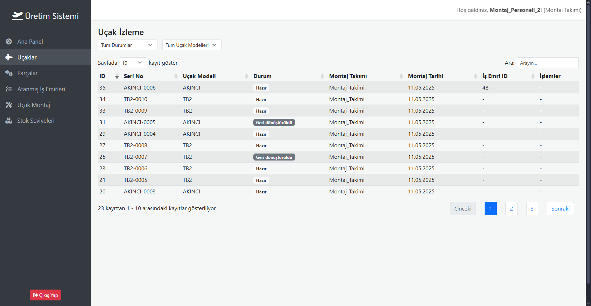
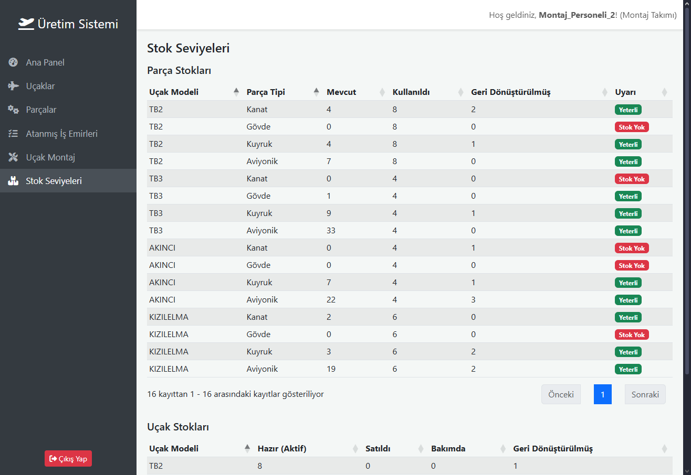

# Hava Aracı Üretim Takip Sistemi

## Proje Tanıtımı

Bu proje, bir durum çalışması (case study) kapsamında geliştirilmiş bir **Hava Aracı Üretim Takip Sistemi**'dir. Django ve Django Rest Framework kullanılarak geliştirilen bu uygulama, farklı hava aracı modellerinin (TB2, TB3, AKINCI, KIZILELMA) üretim süreçlerini, parça yönetimini (Kanat, Gövde, Kuyruk, Aviyonik), takım ve personel yönetimini, iş emirlerini ve stok takibini kapsamaktadır.

Sistem, farklı kullanıcı rollerine (Yönetici, Montajcı, Üretimci) göre özelleştirilmiş arayüzler ve yetkilendirmeler sunarak, üretim sürecinin her aşamasının verimli bir şekilde yönetilmesini hedefler. API tabanlı mimarisi sayesinde, gelecekte farklı platformlarla entegrasyon potansiyeline sahiptir.

Proje, modern web teknolojileri ve en iyi pratikler göz önünde bulundurularak geliştirilmiş olup, özellikle server-side DataTable entegrasyonu, yumuşak silme (soft delete) mekanizmaları, otomatik seri numarası üretimi ve rol bazlı yetkilendirme gibi özelliklerle donatılmıştır.


## Kullanılan Teknolojiler

Projenin geliştirilmesinde aşağıdaki teknolojiler ve kütüphaneler kullanılmıştır:

- **Proje Docker uyumlu hale getirilmiştir. Tar yedeği proje içerisinde, aynı zamanda docker hub'da yüklenmiştir.**
- **Backend:**
  - Python 3.12+
  - Django 5.2+
  - Django Rest Framework (DRF)
  - PostgreSQL (Veritabanı)
  - `psycopg2-binary` (PostgreSQL adaptörü)
  - `django-filter` (API filtreleme için)
  - `drf-spectacular` (OpenAPI 3.0 şeması ve Swagger/ReDoc dokümantasyonu için)
  - `python-dotenv` (Ortam değişkenleri yönetimi için)
- **Frontend (Basit Arayüz):**
  - HTML5
  - CSS3
  - Bootstrap 5
  - JavaScript (ES6+)
  - jQuery 3.6+
  - jQuery DataTables (Server-side processing ile)
  - Font Awesome (İkonlar için)
- **Veritabanı:**
  - PostgreSQL
- **Versiyon Kontrol:**
  - Git & GitHub
- **Geliştirme Ortamı:**
  - VSCode
  - Python Sanal Ortamı (`venv`)

## Proje Özellikleri ve Uygulama İsterlerinin Karşılanması

Bu bölümde, "Uygulama İsterleri" ve "Ekstralar (Bonus)" başlıkları altında belirtilen maddelerin projede nasıl hayata geçirildiği detaylandırılmaktadır. Projenin birim test haricindeki tüm isterleri karşılanmıştır. Screenshots klasöründe her ekranın detaylı fotoğrafı ve açıklaması fotoğraf olarak da paylaşılmıştır.

### Temel Varlıklar ve Yönetimi

- **Parçalar (Kanat, Gövde, Kuyruk, Aviyonik):**
  - `PartCategory` enum'ı ile 4 ana kategori sabit olarak tanımlanmıştır.
  - `PartType` modeli, bu kategorileri ve hangi takım tipi tarafından üretilebileceğini (kod içinde sabitlenmiş mantıkla) yönetir. Admin panelinden yeni kategori eklenemez, sadece mevcutların ilişkileri yönetilebilir.
  - Her bir fiziksel parça `Part` modelinde, benzersiz seri numarası, uyumlu olduğu uçak modeli, üreten takım/personel, üretim tarihi ve durumu (`AVAILABLE`, `USED`, `RECYCLED`) ile takip edilir.
- **Uçaklar (TB2, TB3, AKINCI, KIZILELMA):**
  - `AircraftModelChoices` enum'ı ile 4 ana uçak modeli sabit olarak tanımlanmıştır.
  - `AircraftModel` modeli bu sabit tipleri temsil eder. Admin panelinden yeni model eklenemez. Bu modeller data migration ile veritabanına eklenmiştir.
  - Monte edilmiş her bir uçak `Aircraft` modelinde, benzersiz seri numarası, modeli, montaj tarihi/takımı/personeli, durumu (`ACTIVE`, `RECYCLED`) ve kullanılan spesifik parçalar (`wing`, `fuselage`, `tail`, `avionics` için `OneToOneField`) ile takip edilir.
- **Takımlar (Kanat Takımı, Gövde Takımı, Kuyruk Takımı, Aviyonik Takımı, Montaj Takımı):**
  - `DefinedTeamTypes` enum'ı ile 5 ana takım tipi sabit olarak tanımlanmıştır.
  - `Team` modeli, admin tarafından oluşturulabilen takımları, adlarını ve bu sabit tiplerden birini içerir.
  - Bir takımın montaj yapabilme (`can_perform_assembly()`) veya hangi parça kategorisini üretebileceği (`get_producible_part_category()`) yetenekleri, modeldeki `team_type` alanına göre dinamik olarak belirlenir.

### Fonksiyonel İsterler

1.  **Personel Giriş Ekranı:**

    - `aircraft_production_app/templates/aircraft_production_app/login.html` adresinde, Bootstrap ile tasarlanmış bir giriş ekranı bulunmaktadır.
    - Giriş işlemi, jQuery Ajax kullanılarak `/api-token-auth/` (DRF `obtain_auth_token`) API endpoint'ine `POST` isteği ile yapılır. Başarılı girişte alınan token, `localStorage`'da saklanır.


2.  **Personelin Takımı:**

    - `Personnel` modeli, Django'nun `User` modelini `OneToOneField` ile genişletir ve her personelin bir `Team`'e atanmasını sağlar (`ForeignKey`).
    - Bir takımda birden fazla personel (`Team.members` ters ilişkisi) olabilir.
    - Admin ve uygulama yönetim panelinden personel-takım atamaları yönetilebilir.

3.  **Takımların Parça Yönetimi (Üretimci Rolü):**

     - **Üretme:** Üretimci personel, frontend arayüzündeki "Parça Üret" formundan sadece hedef uçak modelini seçerek parça üretebilir. Parçanın tipi (kategorisi), üreten takım ve üreten personel API (`PartViewSet.perform_create`) tarafından otomatik olarak atanır. Seri numarası da modelin `save()` metodunda otomatik üretilir.
     - **Listeleme:** Üretimci, `/api/parts/` endpoint'i üzerinden sadece kendi takımının ürettiği parçaları (tüm durumlar dahil, filtreleme imkanıyla) listeleyebilir. Bu liste, frontend'de server-side DataTable ile gösterilir.
     - **Geri Dönüşüm (Yumuşak Silme):** Üretimci, kendi takımının ürettiği ve henüz bir uçağa takılı olmayan (`USED` durumunda olmayan) parçaları "geri dönüştürebilir". Bu işlem, API (`DELETE /api/parts/{id}/`) üzerinden parçanın durumunu `RECYCLED` olarak günceller. Fiziksel silme yapılmaz.


4.  **Takım Sorumlulukları ve Kısıtlamalar:**

    - **Takımlar kendi sorumluluğundan başka parça üretemez:** `Part.clean()` metodu ve `PartViewSet.perform_create()` içinde, bir parçayı üretecek takımın tipinin, o parçanın kategorisini üretebilme yeteneğine sahip olup olmadığı kontrol edilir. (Örn: Aviyonik Takımı sadece Aviyonik kategorisinde parça üretebilir).
    - **Montaj takımı parça üretemez:** Özel izin sınıfı ve `PartViewSet.perform_create()` içindeki kontrollerle engellenir.

5.  **Montaj Takımının Uçak Üretimi (Montajcı Rolü):**

    - Montajcı personel, frontend arayüzündeki "Uçak Montaj" formundan sadece monte edilecek uçak modelini (görsel seçici ile) ve isteğe bağlı olarak bir iş emrini seçer.
    - API (`POST /api/assembly/assemble-aircraft/`), seçilen model için gerekli olan her bir ana parça kategorisinden (Kanat, Gövde, Kuyruk, Aviyonik) `AVAILABLE` (Mevcut) durumda ve uyumlu birer parçayı otomatik olarak bulur (FIFO prensibiyle).
    - Tüm parçalar bulunursa, yeni bir `Aircraft` kaydı oluşturulur. `Aircraft.save()` metodu otomatik olarak seri numarası atar ve kullanılan parçaların durumunu `USED` olarak günceller.


6.  **Parça-Uçak Uyumluluğu:**

    - **Her parça uçağa özeldir (TB2 kanadı TB3 kanadına takılamaz):** `Part` modelindeki `aircraft_model_compatibility` alanı, parçanın hangi uçak modeliyle uyumlu olduğunu belirtir. `Aircraft` modelinin `clean()` metodu, monte edilen parçaların (kanat, gövde vb.) `aircraft_model_compatibility` alanının, monte edilen uçağın `aircraft_model`'i ile eşleştiğini doğrular.

7.  **Montaj Takımının Üretilen Uçakları Listelemesi:**

    - Montajcı, `/api/aircraft/` endpoint'i üzerinden sadece kendi takımının monte ettiği uçakları (tüm durumlar dahil, filtreleme imkanıyla) listeleyebilir. Bu liste, frontend'de server-side DataTable ile gösterilir. Montajcı, bir uçağı geri dönüştüremez.



8.  **Envanterde Eksik Parça Uyarısı:**

    - `/api/inventory/stock-levels/` API endpoint'i, her bir (Uçak Modeli, Parça Tipi) kombinasyonu için `AVAILABLE` stok sayısını ve eğer bu sayı sıfır ise `warning_zero_stock: true` bilgisini döndürür.
    - Frontend'de bu bilgi kullanılarak, özellikle ana panelde veya stok seviyeleri sayfasında, stoğu bitmiş parçalar için uyarılar gösterilir. Rol bazlı (Admin/Montajcı tümünü, Üretimci kendi kategorisini) uyarı gösterimi yapılır.


9.  **Parça Kullanım ve Stok Azaltma:**

    - **Bir uçakta kullanılan parça başka uçakta kullanılamaz:** `Aircraft` modelindeki `wing`, `fuselage`, `tail`, `avionics` alanları `Part` modeline `OneToOneField` ile bağlıdır. Bu, bir parçanın aynı anda sadece bir uçağın bir slotunda kullanılabilmesini garantiler.
    - **Stok sayısından azaltılmalıdır:** Bir parça uçağa monte edildiğinde (`Aircraft.save()` metodu içinde), o parçanın `status` alanı `USED` (Kullanıldı) olarak güncellenir. "Mevcut stok" sayısı, `status='AVAILABLE'` olan parçaların sayılmasıyla dinamik olarak hesaplandığı için, `USED` olan bir parça otomatik olarak mevcut stoktan düşmüş olur.

10. **Kullanılan Parça Bilgilerinin Takibi:**
    - `Aircraft` modeli, `wing`, `fuselage`, `tail`, `avionics` alanları aracılığıyla hangi spesifik `Part` nesnelerinin kullanıldığını doğrudan saklar.
    - `Part` modelindeki `get_installed_aircraft_info()` metodu ve `PartSerializer`'daki ilgili alan, bir parçanın hangi uçakta kullanıldığını gösterir.
    - Bu bilgiler, API cevaplarında ve frontend listelemelerinde sunulur.

### Teknoloji İsterleri ve Ekstralar (Bonus)

- **Python, Django, PostgreSQL, Django Rest Framework:** Projenin temelini oluşturmaktadır.
- **Server-Side DataTable Kullanılması:** İş Emirleri, Parçalar ve Uçaklar için listeleme API'leri (`WorkOrderViewSet`, `PartViewSet`, `AircraftViewSet`) DRF'in pagination, filtreleme (`django-filter`, `OrderingFilter`, `SearchFilter`) özellikleriyle donatılmış ve frontend'de jQuery DataTables'ın server-side processing moduyla entegre edilmiştir. Bu, performanslı ve kullanıcı dostu listelemeler sağlar.


- **Ön Yüzde Asenkron (Ajax, Fetch vs.) Yapı Kullanılması:** Frontend'deki tüm veri çekme, form gönderme ve dinamik içerik güncellemeleri jQuery Ajax kullanılarak API endpoint'leri üzerinden asenkron olarak yapılmaktadır.
- **İlişkisel Tabloların Ayrı Ayrı Tutulması:** Django ORM'nin doğası gereği, modellerimiz (`Team`, `Part`, `Aircraft` vb.) veritabanında ayrı ilişkisel tablolar olarak temsil edilmektedir. `ForeignKey`, `OneToOneField` gibi alanlarla bu tablolar arasında mantıksal bağlantılar kurulmuştur.

- **Django İçin Ekstra Kütüphaneler Kullanılması:** `django-filter` ve `drf-spectacular` gibi kütüphaneler projeye değer katmıştır.
- **Ön Yüze (Front-End) Bootstrap, Tailwind, Jquery vs. Kullanılması:** Frontend arayüzü Bootstrap 5 ve jQuery kullanılarak geliştirilmiştir.
- **API Docs (Swagger):** `drf-spectacular` kütüphanesi ile `/api/schema/swagger-ui/` ve `/api/schema/redoc/` adreslerinde otomatik API dokümantasyonu sunulmaktadır.


- **İyi Hazırlanmış Dokümantasyon ve Yorum Satırları:** Bu README dosyası ve kod içindeki yorumlar bu maddeyi karşılamayı hedefler.
- **Projenin Docker ile Ayağa Kalkması:** Projenin tam kapsamlı, içinde verileri de dahil olmak üzere alınmış docker imaj yedeği bu repo içerisinde ve Docker Hub'da mevcuttur.
- **Manuel Testler:** Zaman kısıtından dolayı birim test tamamlanamamış olsa da detaylı manuel ön yüz ve API tüm senaryolarla detaylı olarak yapılmıştır.


## Kurulum ve Çalıştırma

Projeyi lokal makinenizde kurmak ve çalıştırmak için aşağıdaki adımları izleyin:

1.  **Depoyu Klonlayın:**

    ```bash
    git clone https://github.com/isikmuhamm/uav-production-software
    cd uav-production-software
    ```

2.  **Sanal Ortam Oluşturun ve Aktifleştirin:**

    ```bash
    python -m venv venv
    # Windows
    .\venv\Scripts\activate
    # Linux/macOS
    source venv/bin/activate
    ```

3.  **Gerekli Kütüphaneleri Yükleyin:**

    ```bash
    pip install -r requirements.txt
    ```

4.  **PostgreSQL Veritabanı Kurulumu:**

    - Makinenizde PostgreSQL sunucusunun kurulu ve çalışır durumda olduğundan emin olun.
    - `psql` veya pgAdmin gibi bir araçla bağlanarak proje için bir veritabanı ve bu veritabanına erişim yetkisi olan bir kullanıcı oluşturun. Örnek komutlar (kullanıcı adı, şifre ve veritabanı adını kendinize göre değiştirin):
      ```sql
      CREATE DATABASE hava_araci_uretim_db;
      CREATE USER django_project_user WITH PASSWORD 'GucluS1fre!';
      ALTER ROLE django_project_user SET client_encoding TO 'utf8';
      ALTER ROLE django_project_user SET default_transaction_isolation TO 'read committed';
      ALTER ROLE django_project_user SET timezone TO 'UTC';
      GRANT ALL PRIVILEGES ON DATABASE hava_araci_uretim_db TO django_project_user;
      ```

5.  **Ortam Değişkenlerini Ayarlayın:**

    - Proje kök dizininde `.env` adında bir dosya oluşturun.
    - Aşağıdaki şablona göre kendi PostgreSQL bağlantı bilgilerinizi ve Django `SECRET_KEY`'inizi girin:

      ```env
      # .env dosyası
      DEBUG=True
      SECRET_KEY='django_secret_keyinizi_buraya_koyun_cok_guvenli_bir_sey_olsun!'

      DB_NAME=hava_araci_uretim_db
      DB_USER=django_project_user
      DB_PASSWORD=GucluS1fre!
      DB_HOST=localhost
      DB_PORT=5432
      ```

6.  **Veritabanı Migration'larını Çalıştırın:**
    Bu komutlar, veritabanı şemasını oluşturacak ve data migration ile sabit verileri (Uçak Modelleri, Parça Tipleri) ekleyecektir.

    ```bash
    python manage.py makemigrations aircraft_production_app
    python manage.py migrate
    ```

7.  **Süper Kullanıcı Oluşturun (Admin Paneli ve API Testleri İçin):**

    ```bash
    python manage.py createsuperuser
    ```

    İstenen bilgileri girerek bir süper kullanıcı oluşturun. Bu kullanıcıyı, admin rolü için `Personnel` olarak da atamayı unutmayın (admin panelinden).

8.  **Geliştirme Sunucusunu Başlatın:**

    ```bash
    python manage.py runserver
    ```

9.  **Uygulamaya Erişin:**

    - **Personel Arayüzü (Giriş):** `http://127.0.0.1:8000/app/login/`
    - **Django Admin Paneli:** `http://127.0.0.1:8000/admin/`
    - **API Dokümantasyonu (Swagger UI):** `http://127.0.0.1:8000/api/schema/swagger-ui/`
    - **API Dokümantasyonu (ReDoc):** `http://127.0.0.1:8000/api/schema/redoc/`

10. **Docker ile isikmuhamm/uav-production-app:latest paketini internetten çekerek çalıştırın:**
    ```bash
    docker pull isikmuhamm/uav-production-app:latest
    ```
    - Django server üzerinde 7. maddede verilen bilgi ile süper yetkili bir hesap oluşturulabilir. Bunun yerine mevcut olan hesaplar da kullanılarak ürün incelenebilir. Yönetici hesabı "bayraktar" olup bütün şifreler "Sifre1234" olarak belirlenmiştir.

## API Endpoint'lerine Genel Bakış

Proje, aşağıdaki ana API endpoint'lerini sunmaktadır (Detaylar için Swagger/ReDoc dokümantasyonuna bakın):

- `/api-token-auth/` (POST): Kullanıcı girişi ve token alma.
- `/api/user/me/` (GET): Giriş yapmış kullanıcının bilgilerini alma.
- `/api/aircraft-models/` (GET): Sabit uçak modellerini listeleme.
- `/api/part-types/` (GET): Sabit parça tiplerini (kategorilerini) listeleme.
- `/api/teams/` (GET, POST, PUT, DELETE - Admin yetkili): Takım yönetimi.
- `/api/personnel/` (GET, POST, PUT, DELETE - Admin yetkili): Personel yönetimi.
- `/api/work-orders/` (GET, POST, PUT, DELETE - Rol bazlı yetkilendirme): İş emri yönetimi.
- `/api/parts/` (GET, POST, PUT, DELETE - Rol bazlı yetkilendirme): Parça yönetimi.
- `/api/aircraft/` (GET, POST, PUT, DELETE - Rol bazlı yetkilendirme): Monte edilmiş uçak yönetimi.
- `/api/assembly/assemble-aircraft/` (POST - Montajcı yetkili): Otomatik parça atama ile uçak montajı.
- `/api/inventory/stock-levels/` (GET): Rol bazlı parça ve uçak stok seviyelerini listeleme.

## Projenin Geliştirilme Adımları, Proje Gereksinimlerin Tamamlanma Durumu

### I. Temel Altyapı ve Veritabanı

- [x] Django projesi ve `aircraft_production_app` uygulaması oluşturuldu.
- [x] PostgreSQL veritabanı entegrasyonu tamamlandı.
- [x] Ortam değişkenleri için `.env` dosyası kullanıldı.
- [x] Gerekli kütüphaneler (`Django Rest Framework`, `django-filter`, `drf-spectacular` vb.) kuruldu.

### II. Model Tanımlamaları ve İş Mantığı

- [x] **Sabit Tipler:**
  - [x] Uçak Modelleri (TB2, TB3, AKINCI, KIZILELMA) enum ile tanımlandı ve data migration ile eklendi.
  - [x] Parça Kategorileri (Kanat, Gövde, Kuyruk, Aviyonik) enum ile tanımlandı ve data migration ile eklendi.
  - [x] Takım Tipleri (Kanat, Gövde, Kuyruk, Aviyonik, Montaj) enum ile tanımlandı.
- [x] **Ana Modeller:**
  - [x] `Team`: Adı ve sabit tiplerden seçilen takım tipi.
  - [x] `Personnel`: Django User ile birebir ilişkili, bir takıma bağlı.
  - [x] `PartType`: Sabit parça kategorilerini temsil eder.
  - [x] `AircraftModel`: Sabit uçak modellerini temsil eder.
  - [x] `WorkOrder`: İş emirleri, uçak modeli, miktar, durum, oluşturan admin, atanan montaj takımı.
  - [x] `Part`: Üretilmiş tekil parçalar; seri no, parça tipi, uyumlu model, üreten takım/personel, durum.
  - [x] `Aircraft`: Monte edilmiş uçaklar; seri no, model, montaj takımı/personeli, durum, kullanılan parçalar (OneToOne).
- [x] **Otomatik İşlemler:**
  - [x] `Part` ve `Aircraft` için otomatik ve benzersiz seri numarası üretimi.
  - [x] Uçak montajında/sökümünde `Part` durumlarının (`USED`/`AVAILABLE`) otomatik güncellenmesi.
  - [x] İş emri durumunun (`PENDING`/`ASSIGNED`/`IN_PROGRESS`/`COMPLETED`) otomatik güncellenmesi (sinyallerle).
- [x] **Veri Bütünlüğü:**
  - [x] Modellerde `clean()` metotları ile iş kuralları ve veri doğrulama.
  - [x] Takımların kendi sorumluluğundaki parçaları üretebilmesi, montaj takımının parça üretememesi.
  - [x] Parça-uçak modeli uyumluluk kontrolleri.
  - [x] Üretim için takımda personel varlığı kontrolü.
- [x] **Yumuşak Silme (Soft Delete):**
  - [x] `Part` silindiğinde durumu `RECYCLED` olur.
  - [x] `WorkOrder` silindiğinde durumu `CANCELLED` olur, uçak bağlantıları kesilir.
  - [x] `Aircraft` silindiğinde durumu `RECYCLED` olur, parça bağlantıları kesilir, parçalar `AVAILABLE` olur.
- [x] **Kayıt Bilgileri:**
  - [x] Parça ve Uçak kayıtlarında oluşturan/montaj yapan personel ve oluşturma/güncelleme tarihleri.

### III. Django Admin Paneli

- [x] Tüm modeller admin paneline kaydedildi ve yönetilebilir durumda.
- [x] Liste görünümleri, filtreler, arama alanları özelleştirildi.
- [x] İlişkili veriler (örn: takımdaki personel sayısı) gösteriliyor.
- [x] Sabit tipler (Uçak Modeli, Parça Tipi) için ekleme/değiştirme/silme kısıtlandı.
- [x] Otomatik alan atamaları (örn: `WorkOrder.created_by`) ve yumuşak silme işlemleri admin panelinden de çalışıyor.

### IV. API Geliştirme (Django Rest Framework)

- [x] **Kimlik Doğrulama:** Token tabanlı giriş (`/api-token-auth/`) ve kullanıcı bilgisi (`/api/user/me/`) endpoint'leri.
- [x] **Serializer'lar:** Tüm ana modeller için detaylı serializer'lar.
- [x] **ViewSet'ler ve APIView'lar:**
  - [x] Sabit veriler (`AircraftModel`, `PartType`) için salt okunur listeleme.
  - [x] `Team`, `Personnel` için Admin CRUD yetkili API'ler.
  - [x] `WorkOrderViewSet`: Admin CRUD, Montajcı belirli iş emirlerini listeler.
  - [x] `PartViewSet`: Üretimci parça üretir/listeler/geri dönüştürür; Montajcı mevcut parçaları listeler.
  - [x] `AircraftViewSet`: Admin CRUD; Montajcı kendi uçaklarını listeler/geri dönüştürür.
  - [x] `AssembleAircraftAPIView`: Montajcı için otomatik parça atama ile uçak montajı.
  - [x] `stock_levels_api_view`: Rol bazlı parça ve uçak stoklarını listeler, sıfır stok uyarısı verir.
- [x] **İzinler (Permissions):** Rol bazlı erişim kontrolü için özel izin sınıfları.
- [x] **Filtreleme, Sıralama, Arama:** `django-filter`, `OrderingFilter`, `SearchFilter` ile API'lere eklendi.
- [x] **Pagination:** Özel `StandardDataTablePagination` ile DataTable uyumlu API cevapları.
- [x] **API Dokümantasyonu (Swagger/ReDoc):** `drf-spectacular` ile `/api/schema/swagger-ui/` ve `/api/schema/redoc/` adreslerinde otomatik dokümantasyon.

### V. Frontend (Django Templates + jQuery/Ajax)

- [x] Temel HTML şablon yapısı (`base.html`, `login.html`, `dashboard_admin.html`).
- [x] Statik dosyalar (`main.js`) ve global JavaScript değişkenleri ayarlandı.
- [x] Personel giriş/çıkış işlevselliği API'ye bağlandı.
- [x] Dashboard'da rol bazlı menü ve temel içerik alanlarının gösterimi/gizlenmesi.
- [x] **Bütün izleme ve takip listeleri:** Server-side DataTable ile entegre edildi. Sayfalandırma, arama, sıralama, durum filtreleri eklendi.
- [x] **Görsel Uçak Seçimi:** Formlarda (İş Emri, Parça Üret, Uçak Montaj) tıklanabilir resimlerle uçak modeli seçimi.
- [x] **Formlar:** Yeni İş Emri, Parça Üret, Uçak Montaj formları Ajax ile API'ye bağlanıyor.
- [x] **Stok Seviyeleri:** API'den veri çekilip datatable ile gösteriliyor.

### VI. Ekstralar (Bonus)

- [x] Server-Side DataTable Kullanılması. Bütün listeleme sayfaları için tamamlandı.
- [x] Ön Yüzde Asenkron (Ajax, Fetch vs.) Yapı Kullanılması.
- [x] İlişkisel Tabloların Ayrı Ayrı Tutulması.
- [x] Django İçin Ekstra Kütüphaneler Kullanılması (`django-filter`, `drf-spectacular`).
- [x] Ön Yüzde (Front-End) Bootstrap, Jquery Kullanılması.
- [x] API Docs (Swagger). Kod içerisinde yazılmış detaylı bilgi satırlarıyla otomatik oluşan dokumanlar.
- [x] Projenin Docker ile Ayağa Kalkması.
- [x] İyi Hazırlanmış Dokümantasyon ve Yorum Satırları (Bu README ve kod içi yorumlar tamamlandı.
- [ ] Birim Testi yapılmadı, ancak manuel ve API testleri kapsamlı senaryolarla tamamlandı.

## Projenin Tüm Fotoğrafları

### Yöneticinin gördüğü django database yönetim ekranları


### Giriş ve Kayıt Ekranları


### Uygulama yönetici paneli


### Uygulama montajcı paneli




### Uygulama üretimci paneli


### Database ilişkileri, postman, swagger, dokumantasyon


## Katkıda Bulunma

Bu proje bir case study olarak geliştirilmiş olup, şu an için aktif katkı kabul etmemektedir. Ancak, olası iyileştirme önerileri veya hata bildirimleri için GitHub Issues bölümünü kullanabilirsiniz.

Eğer projeyi fork'layıp kendi geliştirmelerinizi yapmak isterseniz, standart Git ve GitHub akışlarını takip edebilirsiniz.

## Lisans

Bu proje için bir lisans belirtilmemiştir.
